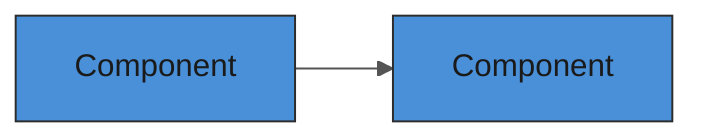

# Create GitHub Issue

Create issues on `bigboy1122/scrap-machine` using the `gh` CLI. All issues must be **AI-first** -- written with enough context that an AI agent can pick up and implement without asking clarifying questions.

## Issue Types

| Type | Label | Title Prefix | Template |
|------|-------|-------------|----------|
| Feature | `feature` | `feat:` | `.github/ISSUE_TEMPLATE/feature.yml` |
| Bug | `bug` | `fix:` | `.github/ISSUE_TEMPLATE/bug.yml` |
| Decision | `decision` | `DECIDE:` | `.github/ISSUE_TEMPLATE/decision.yml` |
| Task | `task` | `chore:` | `.github/ISSUE_TEMPLATE/task.yml` |

## Workflow

1. Determine the issue type from context.
2. Gather all required fields for that type.
3. Write the body using **GitHub Flavored Markdown**:
   - Task lists with `- [ ]` checkboxes
   - Tables for comparing options
   - Mermaid diagrams for architecture/flow when there are 3+ components
   - Code blocks with language tags
   - `> [!NOTE]` / `> [!WARNING]` callouts for important context
   - Cross-references to other issues with `#NN`
4. Create the issue using `gh issue create`.

## Required Sections (by type)

### Feature Issues
- **Summary** -- full context paragraph
- **User Stories** -- `As a [role], I want [capability], so that [benefit]`
- **Requirements** -- checkbox list of specific deliverables
- **Acceptance Criteria** -- checkbox list of testable pass/fail conditions
- **Definition of Done** -- standard checklist (see below)
- **Technical Context** -- affected files, systems, architecture diagrams
- **Scope Boundaries** -- what's in/out of scope
- **Dependencies** -- links to blocking issues

### Bug Issues
- **Summary** -- what's broken, impact
- **Steps to Reproduce** -- numbered, exact steps
- **Expected vs Actual Behavior**
- **Technical Context** -- stack traces, console output, relevant files
- **Definition of Done** -- root cause found, fix + test + verification

### Decision Issues
- **Context** -- problem, constraints, what we're optimizing for
- **Options Table** -- pros, cons, prize impact for each option
- **Impact & Dependencies** -- what this blocks or affects
- **Deadline** -- when must we decide

## Standard Definition of Done

Include this in every feature and bug issue:

```markdown
- [ ] Feature implemented and matches all acceptance criteria
- [ ] Unit tests written and passing (80%+ coverage on new code)
- [ ] Browser test covering the happy path
- [ ] No ESLint errors or warnings
- [ ] Logging added for key state transitions
- [ ] Code reviewed and merged to `main`
```

## AI-First Writing Rules

1. **Never assume context** -- state everything explicitly. The reader may be an AI agent in a fresh session with no conversation history.
2. **Include file paths** -- always mention which files are relevant and where they are.
3. **Show don't tell** -- use code snippets, mermaid diagrams, and examples over prose.
4. **Link everything** -- reference related issues, specs, docs, and external resources.
5. **Be specific** -- "the tile grid" is vague; "`src/entities/TileGrid.ts` (the hexagonal tile grid system)" is specific.

## Mermaid Diagrams in Issues

When the feature involves 3+ interacting components, include a mermaid diagram. Use the project's standard theme:

```markdown

```

## Creating the Issue

Use the `gh` CLI with a HEREDOC for the body:

```bash
gh issue create \
  --title "feat: add tile claiming mechanic" \
  --label "feature" \
  --body "$(cat <<'EOF'
## Summary
...

## User Stories
...

## Acceptance Criteria
- [ ] ...

## Definition of Done
- [ ] ...
EOF
)"
```

## Labels

Create labels if they don't exist:

```bash
gh label create "feature" --description "New feature" --color "0e8a16"
gh label create "bug" --description "Bug fix" --color "d73a4a"
gh label create "decision" --description "Requires team decision" --color "d93f0b"
gh label create "task" --description "General task" --color "0075ca"
```
