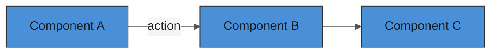

# Create Feature Spec

Every feature starts as a written spec before any code is generated.

## Workflow

1. Ask the user for the feature name if not provided.
2. Copy the template from `docs/templates/spec-template.md`.
3. Create a new file at `specs/<feature-name>.md`.
4. Fill in as much as possible from context; leave `[TBD]` for unknowns.
5. Always fill in: Objective, User Stories, Acceptance Criteria, Definition of Done, Scope Boundaries.
6. Include a mermaid architecture diagram if the feature involves 3+ interacting components.
7. Create a corresponding GitHub issue using the `create-issue` skill.
8. Present the spec to the user for review before implementation begins.

## Template

The full template lives at [`docs/templates/spec-template.md`](../../docs/templates/spec-template.md). Read it and use it as the base for every new spec.

Key sections that MUST be filled in (not left as placeholders):

### User Stories (required)
```markdown
- **As a** player, **I want** [capability], **so that** [benefit].
- **As a** developer, **I want** [capability], **so that** [benefit].
```

### Acceptance Criteria (required)
Testable, binary pass/fail conditions:
```markdown
- [ ] Player can click adjacent neutral tiles to claim them
- [ ] Claimed tiles change color to the player's color
- [ ] Server validates the claim before applying it
```

### Definition of Done (required -- use this standard checklist)
```markdown
- [ ] Feature implemented and matches all acceptance criteria
- [ ] Unit tests written and passing (80%+ coverage on new code)
- [ ] Browser test covering the happy path
- [ ] No ESLint errors or warnings
- [ ] Logging added for key state transitions
- [ ] Spec updated if implementation diverged from plan
- [ ] Code reviewed and merged to `main`
```

### Architecture Diagram (when applicable)
If the feature touches 3+ components, include a mermaid diagram:
````markdown

````

## AI-First Writing Rules

- **Never assume context** -- write as if the reader has no conversation history
- **Include file paths** -- always mention which files are relevant
- **Be specific** -- "`src/systems/resource-manager.ts`" not "the resource system"
- **Link everything** -- reference issues (`#NN`), other specs, game-design.md

## Rules

- File name: `specs/<feature-name>.md` using kebab-case
- One spec per feature -- don't combine unrelated features
- Specs are living docs -- update them if requirements change during implementation
- Never delete a spec; mark it as `[SUPERSEDED]` if replaced
- Always create a GitHub issue to track the spec's implementation
