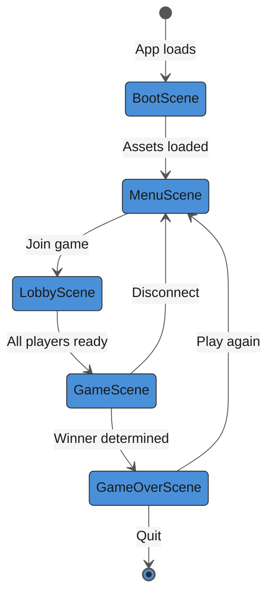
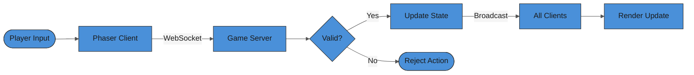

# Mermaid Diagrams for Scrap Machine

Generate Mermaid diagrams embedded in markdown. All diagrams must be readable on both light and dark desktop themes.

## Theme Configuration (MANDATORY)

GitHub renders Mermaid with both light and dark themes depending on the user's OS/browser setting. Use the `base` theme with explicit variables that provide high contrast in both modes:

```
%%{init: {'theme': 'base', 'themeVariables': {
  'primaryColor': '#4A90D9',
  'primaryTextColor': '#1a1a1a',
  'primaryBorderColor': '#2c2c2c',
  'lineColor': '#555555',
  'secondaryColor': '#EBF5FB',
  'tertiaryColor': '#F9EBEA',
  'edgeLabelBackground': '#f5f5f5',
  'clusterBkg': '#f0f0f0',
  'clusterBorder': '#888888',
  'titleColor': '#1a1a1a',
  'nodeTextColor': '#1a1a1a'
}}}%%
```

### Critical Rules

1. **NEVER use `theme: 'dark'`** -- produces light text that disappears on light backgrounds
2. **NEVER use `theme: 'default'` without overrides** -- text can be too light in dark mode on some renderers
3. **primaryTextColor MUST be `#1a1a1a` or darker** -- readable on both light and dark canvases
4. **edgeLabelBackground MUST be light** (`#f5f5f5`) -- ensures edge labels are readable
5. **Borders must be dark** (`#2c2c2c` or darker) -- visible against both light and dark backgrounds
6. **Node fills must have sufficient contrast with `#1a1a1a` text** -- no dark fills without white text override

### Color-Blind Safe Palette for Styled Nodes

When using `classDef` or `style`, use these colors with appropriate text contrast:

| Purpose | Fill | Text | Stroke |
|---------|------|------|--------|
| Primary | `#4A90D9` | `#FFFFFF` | `#2c2c2c` |
| Success | `#2E7D32` | `#FFFFFF` | `#2c2c2c` |
| Warning | `#F9A825` | `#000000` | `#2c2c2c` |
| Error | `#C62828` | `#FFFFFF` | `#2c2c2c` |
| Info | `#6A1B9A` | `#FFFFFF` | `#2c2c2c` |
| Highlight | `#00838F` | `#FFFFFF` | `#2c2c2c` |
| Muted | `#78909C` | `#FFFFFF` | `#2c2c2c` |

Always pair dark fills with `#FFFFFF` text and light fills with `#000000` text. Always add a dark `stroke` for visibility on dark backgrounds.

## Accessibility (MANDATORY)

Every diagram MUST include:

```
accTitle: Short title
accDescr: Description of what the diagram shows
```

## Diagram Types for Game Dev

### Game State Flow (stateDiagram-v2)
Scene transitions, game states (menu, playing, paused, game over).

### System Architecture (flowchart)
Client/server architecture, multiplayer networking, data flow.

### Entity Relationships (erDiagram)
Game data model: players, tiles, resources, upgrades.

### Game Loop Sequence (sequenceDiagram)
Player action -> client -> server -> broadcast -> render cycle.

### Sprint/Jam Timeline (gantt)
Remaining jam days, feature milestones, deployment deadlines.

### Component Hierarchy (classDiagram)
Phaser scene/entity class structure.

## Example: Game State Flow

````markdown

````

## Example: Multiplayer Data Flow

````markdown

````

## Rules

- Always include the full `%%{init:...}%%` theme block -- never omit it
- Always include `accTitle` and `accDescr`
- Keep diagrams under 15-20 nodes -- split complex systems into multiple diagrams
- Use descriptive node labels, not single letters
- Add labels on all edges/arrows to clarify relationships
- Use `LR` for processes/flows, `TD` for hierarchies
- Wrap labels containing special characters in double quotes
- Never use spaces in node IDs -- use camelCase or underscores
