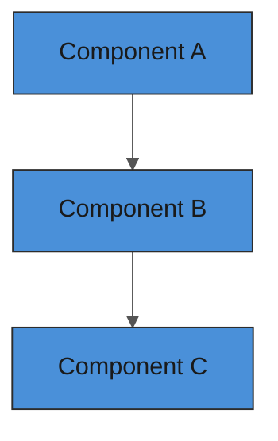

# Spec: [Feature Name]

**Status:** Draft | In Review | Approved | Implemented | Superseded
**Author:** [name]
**Date:** YYYY-MM-DD
**Issue:** [#NN](https://github.com/bigboy1122/scrap-machine/issues/NN)

## Objective

<!-- What this feature does and why it exists. One paragraph.
     Include enough context that an AI agent can implement this
     without needing to ask clarifying questions. -->

## User Stories

<!-- Who benefits and how? Use the standard format. -->

- **As a** [player/developer/system], **I want** [capability], **so that** [benefit].
- **As a** [player/developer/system], **I want** [capability], **so that** [benefit].

## Behavior

<!-- How it works from the player's perspective. Be specific. -->

### Happy Path
1. Player does X
2. System responds with Y
3. Player sees Z

### Edge Cases
- What happens when [edge case 1]?
- What happens when [edge case 2]?

### Error States
- What happens when [failure scenario]?

## Technical Design

<!-- How it will be implemented. Include diagrams where helpful. -->

### Architecture

<!-- Use a mermaid diagram if the system has multiple components: -->



### Key Data Structures

```typescript
// Define interfaces/types here
```

### State Management
- Where state lives (client, server, both)
- How state is synchronized

### Network Considerations
- What messages are sent between client and server
- Latency sensitivity

## Acceptance Criteria

<!-- Checklist of conditions that MUST be true for this feature to be complete.
     These are testable, binary (pass/fail) statements. -->

- [ ] Criterion 1
- [ ] Criterion 2
- [ ] Criterion 3

## Definition of Done

- [ ] Feature implemented and matches all acceptance criteria
- [ ] Unit tests written and passing (80%+ coverage on new code)
- [ ] Browser test covering the happy path
- [ ] No ESLint errors or warnings
- [ ] Logging added for key state transitions
- [ ] Spec updated if implementation diverged from plan
- [ ] Code reviewed and merged to `main`

## Scope Boundaries

<!-- What is explicitly NOT included. Prevents scope creep. -->

**In scope:**
- Item 1
- Item 2

**Out of scope:**
- Item 1 — reason / deferred to [future spec]
- Item 2 — reason

## Dependencies

<!-- Other features, specs, or systems this depends on. -->

- [ ] Dependency 1 — status: [done/in progress/blocked]
- [ ] Dependency 2 — status: [done/in progress/blocked]

## Test Plan

### Unit Tests
- [ ] Test case 1: [what it validates]
- [ ] Test case 2: [what it validates]

### Browser Tests (Playwright)
- [ ] Test case 1: [user flow it validates]

### Manual Verification
- [ ] Visual check: [what to look for]

## References

- Game design doc: [game-design.md](../../game-design.md)
- Related spec: [link]
- External docs: [link]
