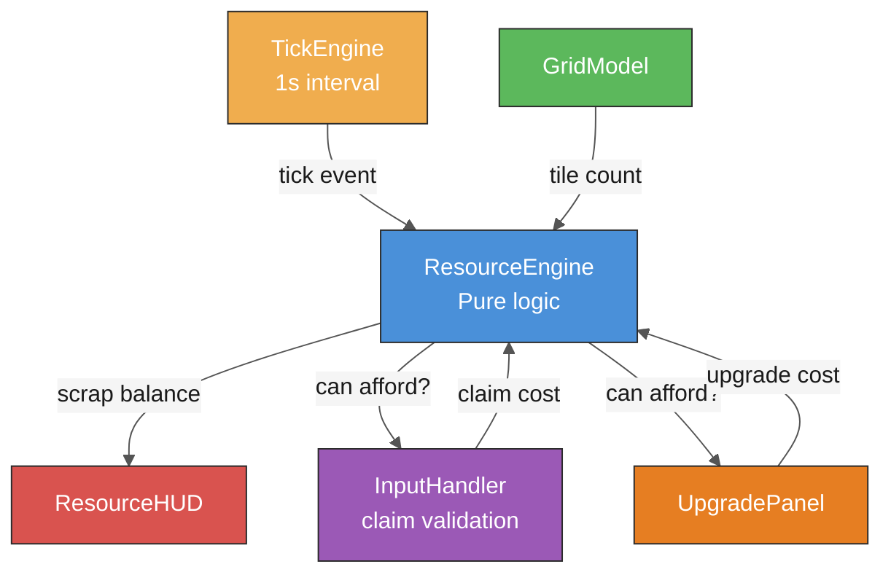

# Spec: Resource Management

**Status:** Draft
**Author:** Team (AI-assisted)
**Date:** 2026-04-14
**Issue:** [#6](https://github.com/bigboy1122/scrap-machine/issues/6)

## Objective

Implement the resource economy that gates territory growth and upgrades. Every tile a player owns produces scrap (the single V1 resource). Scrap is spent to claim new tiles, upgrade attack strength, and upgrade defense. This creates the core strategic tension: expand fast (more income) vs. fortify borders (survive conflicts) vs. invest in attack (absorb opponents). The resource system must be deterministic and tick-based so the host can run it authoritatively in multiplayer.

## User Stories

- **As a** player, **I want** to earn scrap automatically from my territory, **so that** growth feels rewarding and I have a steady income.
- **As a** player, **I want** to see my scrap count and income rate in the UI, **so that** I can plan my next move.
- **As a** player, **I want** claiming a tile to cost scrap, **so that** expansion requires strategic decisions about where and when to grow.
- **As a** player, **I want** to upgrade my attack and defense using scrap, **so that** I can prepare for border conflicts.
- **As a** player, **I want** upgrade costs to escalate, **so that** the game doesn't snowball into an unstoppable lead.
- **As a** developer, **I want** the resource system to be a pure function of state and elapsed ticks, **so that** it's deterministic and unit-testable without Phaser.

## Behavior

### Happy Path
1. Game starts → player has 0 scrap, 3 tiles, income of 3 scrap/tick
2. Each game tick (1 second): player receives `tileCount × incomePerTile` scrap
3. Player clicks a neutral frontier tile → if scrap >= claim cost, tile is claimed and scrap is deducted
4. Player opens upgrade panel → sees current attack/defense levels and the cost to upgrade each
5. Player clicks "Upgrade Attack" → if scrap >= cost, attack level increments and scrap is deducted
6. Player's income grows as territory grows, funding faster expansion
7. Costs escalate: 10th tile costs more than the 3rd, 5th upgrade costs more than the 2nd

### Cost Scaling

Tile claim cost scales with the player's current territory size:

```
claimCost(tileCount) = baseCost + floor(tileCount × scaleFactor)
```

Default values (tunable):

| Parameter | Value | Notes |
|-----------|-------|-------|
| `baseCost` | 5 | Cost to claim the 1st tile beyond spawn |
| `scaleFactor` | 0.5 | Gentle ramp — costs ~15 scrap at 20 tiles, ~25 at 40 |
| `incomePerTile` | 1 | Each tile generates 1 scrap per tick |
| `tickInterval` | 1000ms | One resource tick per second |

Upgrade cost scales exponentially with level:

```
upgradeCost(level) = baseUpgradeCost × (upgradeMultiplier ^ level)
```

| Parameter | Value | Notes |
|-----------|-------|-------|
| `baseUpgradeCost` | 20 | First upgrade costs 20 scrap |
| `upgradeMultiplier` | 1.8 | Each level costs 1.8× the previous |
| `maxLevel` | 10 | Hard cap to prevent infinite scaling |

### Edge Cases
- **Not enough scrap to claim:** Click does nothing. Show brief "Not enough scrap" feedback near the cursor.
- **Not enough scrap to upgrade:** Upgrade button appears disabled/grayed. Tooltip shows cost.
- **Max level reached:** Upgrade button hidden or shows "MAX".
- **Zero tiles (all absorbed):** Income drops to 0. Player is eliminated (handled by combat spec).
- **Tick fires during claim animation:** Scrap is added based on tile count at tick time, not mid-animation state.

### Error States
- **Resource state desync (multiplayer):** Host's resource state is authoritative. If client and host disagree, client resets to host state on next broadcast.

## Technical Design

### Architecture



### Key Data Structures

```typescript
// src/resources/types.ts

interface ResourceConfig {
  readonly incomePerTile: number;      // scrap earned per tile per tick
  readonly tickIntervalMs: number;     // ms between income ticks
  readonly baseCost: number;           // base cost to claim a tile
  readonly scaleFactor: number;        // tile claim cost scaling
  readonly baseUpgradeCost: number;    // base upgrade cost
  readonly upgradeMultiplier: number;  // exponential upgrade scaling
  readonly maxLevel: number;           // hard cap on upgrade levels
}

interface PlayerResources {
  scrap: number;
  attackLevel: number;
  defenseLevel: number;
  totalEarned: number;   // lifetime scrap earned (stats/analytics)
  totalSpent: number;    // lifetime scrap spent
}

interface ResourceEngine {
  readonly config: ResourceConfig;

  getResources(playerId: number): PlayerResources;
  tick(tileCountByPlayer: Map<number, number>): void;
  getClaimCost(playerId: number, currentTileCount: number): number;
  trySpendClaim(playerId: number, currentTileCount: number): boolean;
  getUpgradeCost(type: 'attack' | 'defense', currentLevel: number): number;
  tryUpgrade(playerId: number, type: 'attack' | 'defense'): boolean;
  getIncomeRate(tileCount: number): number;
  serialize(): Record<number, PlayerResources>;
  deserialize(state: Record<number, PlayerResources>): void;
}
```

### File Structure

```
src/
  resources/
    types.ts             # Interfaces and config
    resource-engine.ts   # Pure resource logic (no Phaser)
    resource-hud.ts      # Phaser UI: scrap counter, income rate display
    upgrade-panel.ts     # Phaser UI: upgrade buttons with costs
    index.ts             # Barrel export
```

### Integration with Tile Grid

The `InputHandler` (from tile-grid spec) must check affordability before allowing a claim:

```typescript
// In input-handler.ts (updated flow)
function handleTileClick(coord: HexCoord): void {
  if (!gridModel.getFrontier(playerId).some(t => matches(t.coord, coord))) return;
  const tileCount = gridModel.getTerritoryCount(playerId);
  if (!resourceEngine.trySpendClaim(playerId, tileCount)) return; // can't afford
  gridModel.claimTile(coord, playerId);
}
```

### Tick Engine

A simple interval that fires every `tickIntervalMs`. In multiplayer, only the host runs the tick; clients receive updated resource state via P2P channel 0 broadcasts.

```typescript
// src/resources/tick-engine.ts
function createTickEngine(
  config: ResourceConfig,
  onTick: () => void,
): { start(): void; stop(): void; tick(): void };
```

`tick()` is also exposed directly for deterministic testing — call it manually in unit tests without waiting for real time.

### HUD Layout

Minimal overlay in the top-left corner:

```
┌──────────────────┐
│ ⚙ 142 scrap      │
│ +8/s              │
│ ATK: 3  DEF: 2   │
└──────────────────┘
```

- Scrap count updates in real time (tweened, not instant)
- Income rate shown as "+N/s"
- Attack/defense levels shown as compact stats

### State Management

- **ResourceEngine** is pure logic, no Phaser dependency.
- Each player has their own `PlayerResources` state.
- In multiplayer: host runs ResourceEngine for all players. Broadcasts serialized state on channel 0 alongside grid state. Clients display host-provided values.
- Serializable via `serialize()` / `deserialize()` for network transfer and save/load.

## Acceptance Criteria

- [ ] Player earns scrap automatically each tick proportional to tile count
- [ ] Scrap count and income rate are displayed in the HUD
- [ ] Claiming a tile deducts scrap; insufficient scrap prevents the claim
- [ ] Tile claim cost increases as the player's territory grows
- [ ] Player can upgrade attack and defense levels using scrap
- [ ] Upgrade costs escalate exponentially with level
- [ ] Upgrades are capped at `maxLevel` (10)
- [ ] HUD updates scrap count with a smooth tween (not instant jump)
- [ ] "Not enough scrap" feedback shown when clicking an unaffordable tile
- [ ] ResourceEngine works without Phaser (pure unit tests)
- [ ] `serialize()` / `deserialize()` correctly round-trip all player resource state

## Definition of Done

- [ ] Feature implemented and matches all acceptance criteria
- [ ] Unit tests written and passing (80%+ coverage on new code)
- [ ] Browser test covering the happy path (earn scrap → claim tile → scrap deducted)
- [ ] No ESLint errors or warnings
- [ ] Logging added for key state transitions (tick, claim, upgrade, insufficient funds)
- [ ] Spec updated if implementation diverged from plan
- [ ] Code reviewed and merged to `main`

## Scope Boundaries

**In scope:**
- Single resource type (scrap)
- Income from tile ownership
- Tile claim cost with scaling
- Attack and defense upgrades with exponential cost scaling
- HUD for scrap count, income rate, and stat levels
- Upgrade panel UI
- Deterministic tick-based income
- Serialization for multiplayer sync

**Out of scope:**
- Multiple resource types — deferred to post-V1
- Resource trading between players — not planned for V1
- Resource bonuses from specific tile positions — deferred to polish phase
- Combat damage calculations using attack/defense — deferred to `specs/border-conflict.md`
- Wavedash P2P sync of resource state — deferred to `specs/wavedash-integration.md`

## Dependencies

- [ ] Tile grid system (`specs/tile-grid.md`) — needs `GridModel` for tile counts and frontier — status: draft
- [x] Phaser 3 initialized with a working scene
- [x] TypeScript + Vite build pipeline configured

## Test Plan

### Unit Tests (`src/resources/*.test.ts`)
- [ ] `resource-engine`: `tick()` increases scrap by `tileCount × incomePerTile`
- [ ] `resource-engine`: `tick()` with 0 tiles adds 0 scrap
- [ ] `resource-engine`: `getClaimCost()` increases with tile count
- [ ] `resource-engine`: `trySpendClaim()` deducts scrap and returns `true` when affordable
- [ ] `resource-engine`: `trySpendClaim()` returns `false` and does not deduct when unaffordable
- [ ] `resource-engine`: `getUpgradeCost()` increases exponentially with level
- [ ] `resource-engine`: `tryUpgrade()` increments level and deducts scrap
- [ ] `resource-engine`: `tryUpgrade()` returns `false` at max level
- [ ] `resource-engine`: `serialize()` / `deserialize()` round-trip for multiple players
- [ ] `resource-engine`: `totalEarned` and `totalSpent` track correctly across operations

### Browser Tests (Playwright)
- [ ] HUD displays scrap count that increases over time
- [ ] Clicking a tile reduces the displayed scrap count

### Manual Verification
- [ ] HUD is readable and unobtrusive
- [ ] Scrap counter tweens smoothly on income tick
- [ ] Upgrade panel is clear about costs and current levels
- [ ] Cost scaling feels fair — not too punishing, not too free

## References

- Game design doc: [game-design.md](../game-design.md)
- Tile grid spec: [specs/tile-grid.md](./tile-grid.md)
- Spec template: [docs/templates/spec-template.md](../docs/templates/spec-template.md)
