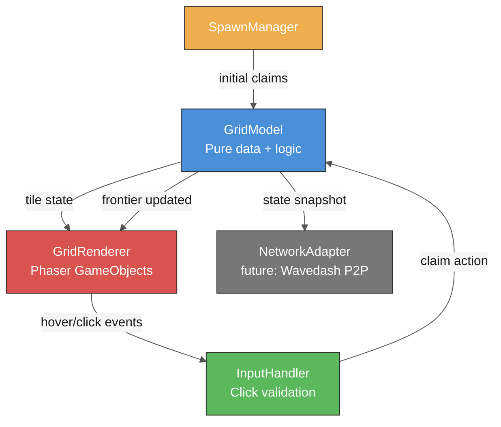

# Spec: Tile Grid & Click-to-Grow

**Status:** Draft
**Author:** Team (AI-assisted)
**Date:** 2026-04-14
**Issue:** [#5](https://github.com/bigboy1122/scrap-machine/issues/5)

## Objective

Implement the shared tile grid that forms the game world for Scrap Machine. The grid is the foundational system — every other mechanic (territory, resources, combat) sits on top of it. Players view a hexagonal grid of scrap tiles, each player starts with a small cluster of claimed tiles (their "machine"), and can click adjacent neutral tiles to grow their territory. This spec covers grid data structures, rendering, player spawn placement, click-to-claim interaction, and the local-only version of growth (networked sync is handled by the Wavedash integration spec).

## User Stories

- **As a** player, **I want** to see a grid of scrap tiles filling the game world, **so that** I understand the playing field and where I can expand.
- **As a** player, **I want** to click on a neutral tile next to my territory to claim it, **so that** I can grow my machine.
- **As a** player, **I want** my tiles to be visually distinct from other players' tiles and neutral tiles, **so that** I can tell my territory from theirs at a glance.
- **As a** player, **I want** to see which tiles I can claim (valid targets) highlighted, **so that** I know where I can grow.
- **As a** developer, **I want** the grid system to be decoupled from rendering, **so that** I can unit-test game logic without Phaser dependencies.
- **As a** developer, **I want** spawn positions to be deterministic given a player count, **so that** multiplayer state is reproducible.

## Behavior

### Happy Path
1. Game starts → a `GridScene` renders a hex grid covering the viewport
2. Player is assigned a spawn position → a 3-tile cluster is pre-claimed in their color
3. Neutral tiles adjacent to the player's territory are subtly highlighted on hover
4. Player clicks a valid adjacent neutral tile → tile animates from neutral to the player's color, territory count increments
5. The claimed tile now borders new neutral tiles, expanding the frontier of clickable targets
6. Other players' tiles are visible in their assigned colors — the player cannot click them (that's combat, a future spec)

### Edge Cases
- **Click on own tile:** No-op, no visual feedback beyond normal hover state.
- **Click on another player's tile:** No-op in this spec (border conflict is a separate spec). Show a "locked" cursor or brief shake animation.
- **Click on non-adjacent neutral tile:** No-op — tile is not in the valid frontier.
- **Rapid clicking:** Each click is processed sequentially. Duplicate claims on the same tile are idempotent.
- **Grid boundary:** Tiles at the edge of the world have fewer neighbors. No wrapping — the grid has hard edges.
- **All neutral tiles claimed:** Growth stops. The game transitions to a pure border-conflict phase (handled by combat spec).

### Error States
- **Grid fails to generate:** Log error, show "Failed to load world" message, allow retry.
- **Player has no valid expansion targets:** Disable grow action, show a "Surrounded!" indicator.

## Technical Design

### Architecture



### Grid Type: Offset Hex (Flat-Top)

Hex grids provide 6 neighbors per tile (vs 4 for square), which creates more organic, blob-like territory shapes that fit the "growing machine" aesthetic. Using **offset coordinates** (odd-q offset) for storage, converting to **cube coordinates** for neighbor/distance calculations.

### Key Data Structures

```typescript
// src/grid/types.ts

interface HexCoord {
  readonly q: number; // column
  readonly r: number; // row
}

interface CubeCoord {
  readonly q: number;
  readonly r: number;
  readonly s: number; // derived: s = -q - r
}

const TileOwner = {
  NEUTRAL: -1,
} as const;

type TileOwnerId = typeof TileOwner.NEUTRAL | number; // player IDs are 0-7

interface TileState {
  readonly coord: HexCoord;
  owner: TileOwnerId;
  claimedAt: number | null; // timestamp of claim, null if neutral
}

interface GridConfig {
  readonly cols: number;       // grid width in tiles
  readonly rows: number;       // grid height in tiles
  readonly tileRadius: number; // hex outer radius in pixels (center to vertex)
}

interface GridModel {
  readonly config: GridConfig;
  readonly tiles: Map<string, TileState>; // key = "q,r"

  getTile(coord: HexCoord): TileState | undefined;
  getNeighbors(coord: HexCoord): TileState[];
  getFrontier(playerId: number): TileState[];  // neutral tiles adjacent to player
  claimTile(coord: HexCoord, playerId: number): boolean;
  getTerritory(playerId: number): TileState[];
  getTerritoryCount(playerId: number): number;
}
```

```typescript
// src/grid/hex-math.ts — pure functions, no Phaser dependency

function offsetToCube(hex: HexCoord): CubeCoord;
function cubeToOffset(cube: CubeCoord): HexCoord;
function cubeDistance(a: CubeCoord, b: CubeCoord): number;
function getNeighborOffsets(q: number): HexCoord[]; // differs for odd/even columns
function hexToPixel(hex: HexCoord, radius: number): { x: number; y: number };
function pixelToHex(x: number, y: number, radius: number): HexCoord;
```

### File Structure

```
src/
  grid/
    types.ts           # Interfaces and type definitions
    hex-math.ts        # Pure coordinate math (offset ↔ cube, neighbors, pixel conversion)
    grid-model.ts      # GridModel implementation (pure data, no Phaser)
    grid-renderer.ts   # Phaser rendering (hex polygons, colors, hover states)
    input-handler.ts   # Click/hover processing, frontier validation
    spawn-manager.ts   # Deterministic spawn position calculation
    index.ts           # Public API barrel export
  scenes/
    GridScene.ts       # Phaser scene that wires everything together
```

### Rendering

Each tile is a Phaser `Graphics` polygon (6-vertex hexagon). Colors:

| State | Fill | Stroke |
|-------|------|--------|
| Neutral | `#3a3a3a` (dark gray) | `#555555` |
| Neutral (hover, not valid) | `#3a3a3a` | `#555555` |
| Neutral (hover, valid target) | `#5a5a5a` (lighter gray) | Player color at 50% alpha |
| Player-owned | Player color (see palette) | Darkened player color |

Player color palette (up to 8 players):

```typescript
const PLAYER_COLORS = [
  0xE06C45, // rust orange (player 0 / local player)
  0x4A90D9, // steel blue
  0x5CB85C, // machine green
  0xD9534F, // warning red
  0xF0AD4E, // spark yellow
  0x9B59B6, // scrap purple
  0x1ABC9C, // teal cyan
  0xE67E22, // copper orange
] as const;
```

### Grid Sizing

Default config for 6-8 players:

```typescript
const DEFAULT_GRID_CONFIG: GridConfig = {
  cols: 40,
  rows: 30,
  tileRadius: 20, // ~35px wide per hex
};
```

Total tiles: 1,200. At 6 players with 3-tile spawns = 18 claimed, 1,182 neutral at start. Provides ample growth space.

### Spawn Placement

Spawns are placed on a circle centered on the grid, evenly distributed by angle. Deterministic given `playerCount` — player `i` gets angle `(2π * i) / playerCount`, mapped to the nearest valid hex.

```typescript
function calculateSpawnPositions(
  config: GridConfig,
  playerCount: number,
): HexCoord[];
```

Each spawn is a 3-tile cluster: the center hex + 2 random neighbors.

### State Management

- **GridModel** is the single source of truth for tile ownership.
- In single-player/prototype mode: state lives entirely on the client.
- In multiplayer mode (future Wavedash spec): the host's GridModel is authoritative. The host broadcasts state diffs on P2P channel 0. Clients maintain a read-only copy of GridModel and send claim requests on channel 1. The host validates and applies them.
- State is serializable: `Map<string, TileOwnerId>` can be serialized as a flat object for network transfer.

### Camera

- Phaser camera follows the player's territory centroid.
- Scroll/zoom allowed within grid bounds.
- Min zoom: full grid visible. Max zoom: ~4 tiles visible.

## Acceptance Criteria

- [ ] A hex grid of configurable size renders on screen with no visual gaps between tiles
- [ ] Each tile displays the correct color for its state (neutral, player-owned)
- [ ] Hovering a valid frontier tile shows a highlight effect
- [ ] Clicking a valid frontier tile claims it (changes owner, updates color)
- [ ] Clicking a non-frontier tile does nothing
- [ ] Clicking an opponent's tile does nothing (no error)
- [ ] Player starts with a 3-tile cluster at their spawn position
- [ ] Spawn positions are evenly distributed for any player count 2-8
- [ ] `GridModel` works independently of Phaser (unit-testable with no canvas)
- [ ] `hexToPixel` and `pixelToHex` correctly round-trip for all grid coordinates
- [ ] Camera follows the player's territory centroid
- [ ] Grid renders at 60fps with 1,200 tiles on a mid-range laptop

## Definition of Done

- [ ] Feature implemented and matches all acceptance criteria
- [ ] Unit tests written and passing (80%+ coverage on new code)
- [ ] Browser test covering the happy path (render grid → click tile → tile changes color)
- [ ] No ESLint errors or warnings
- [ ] Logging added for key state transitions (tile claimed, frontier recalculated)
- [ ] Spec updated if implementation diverged from plan
- [ ] Code reviewed and merged to `main`

## Scope Boundaries

**In scope:**
- Hex grid data model and coordinate math
- Grid rendering with Phaser Graphics
- Click-to-claim a single neutral tile adjacent to player territory
- Hover highlighting for valid targets
- Spawn placement for 2-8 players
- Camera follow and zoom
- Single-player (local) mode — everything runs client-side

**Out of scope:**
- Border conflict / attacking opponent tiles — deferred to `specs/border-conflict.md`
- Resource costs for claiming tiles — deferred to `specs/resource-management.md`
- Multiplayer sync via Wavedash P2P — deferred to `specs/wavedash-integration.md`
- Procedural tile textures (noise, rust) — deferred to art polish phase
- Movement mechanics — deferred per game design doc

## Dependencies

- [x] Phaser 3 initialized with a working scene (`src/scenes/BootScene.ts`)
- [x] TypeScript + Vite build pipeline configured
- [ ] None blocking — this is the first gameplay feature

## Test Plan

### Unit Tests (`src/grid/*.test.ts`)
- [ ] `hex-math`: `offsetToCube` / `cubeToOffset` round-trip for edge and center coordinates
- [ ] `hex-math`: `getNeighborOffsets` returns 6 valid neighbors for both odd and even columns
- [ ] `hex-math`: `hexToPixel` / `pixelToHex` round-trip within floating point tolerance
- [ ] `hex-math`: `pixelToHex` correctly snaps to the nearest hex (not just floor)
- [ ] `grid-model`: `claimTile` on a neutral frontier tile returns `true` and updates owner
- [ ] `grid-model`: `claimTile` on a non-frontier tile returns `false`
- [ ] `grid-model`: `claimTile` on an already-owned tile returns `false`
- [ ] `grid-model`: `getFrontier` returns only neutral tiles adjacent to the player's territory
- [ ] `grid-model`: `getTerritory` returns all tiles owned by a player
- [ ] `grid-model`: `getTerritoryCount` matches `getTerritory().length`
- [ ] `spawn-manager`: `calculateSpawnPositions` returns `playerCount` valid positions
- [ ] `spawn-manager`: spawn positions are within grid bounds for 2-8 players
- [ ] `spawn-manager`: spawn positions are deterministic (same input → same output)

### Browser Tests (Playwright)
- [ ] Grid renders visible hex tiles at game start
- [ ] Clicking a tile adjacent to spawn changes its color to the player's color

### Manual Verification
- [ ] Hex grid looks clean — no gaps, no overlapping tiles, consistent sizing
- [ ] Hover highlight is visually clear but not distracting
- [ ] Claimed tile animation feels responsive (< 100ms visual feedback)
- [ ] Camera follows territory as it grows
- [ ] 1,200 tiles render smoothly without frame drops

## References

- Game design doc: [game-design.md](../game-design.md)
- Hex grid reference: [Red Blob Games — Hexagonal Grids](https://www.redblobgames.com/grids/hexagons/)
- Phaser 3 Graphics API: [Phaser docs](https://newdocs.phaser.io/docs/3.80.0/Phaser.GameObjects.Graphics)
- Spec template: [docs/templates/spec-template.md](../docs/templates/spec-template.md)
